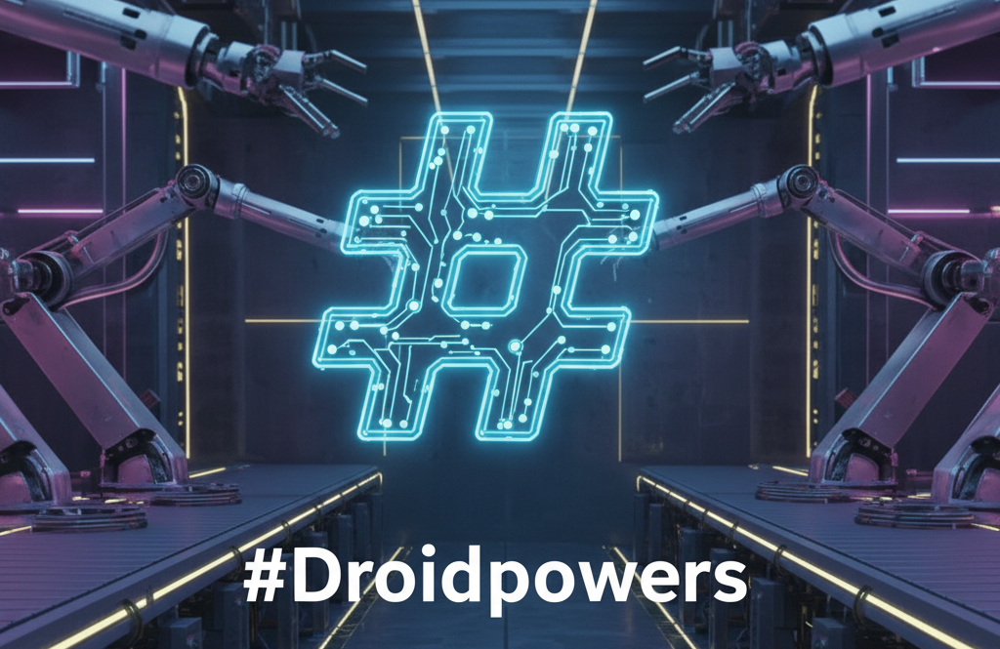

Complete Factory AI adaptation of the superpowers skills system with 100% feature parity and enhanced discoverability.

## Quick Start

1. Copy `.factory/` contents to your project
2. Copy `AGENTS.md.template` to `AGENTS.md` and customize
3. Start using `/droid skill-checker` before any task
4. Follow mandatory workflows automatically

## Available Droids (15 Total)

### Mandatory Gateway
- `/droid using-droids` - **ALWAYS run first** for task analysis
- `/droid skill-checker` - Automatic droid discovery and routing

### Core Skills (Essential for all projects)
- `/droid test-driven-development` - Strict TDD with RED-GREEN-REFACTOR
- `/droid systematic-debugging` - Four-phase bug investigation
- `/droid brainstorming` - Collaborative design refinement  
- `/droid verification-before-completion` - Pre-commit validation
- `/droid writing-skills` - TDD for droid creation

### Advanced Skills
- `/droid condition-based-waiting` - Fix flaky tests
- `/droid defense-in-depth` - Multi-layer validation
- `/droid writing-plans` - Comprehensive planning
- `/droid executing-plans` - Batch task execution
- `/droid requesting-code-review` - Code review coordination
- `/droid receiving-code-review` - Technical feedback evaluation
- `/droid using-git-worktrees` - Isolated development
- `/droid subagent-driven-development` - Parallel task execution

## Quick Commands

All commands have corresponding slash commands:
- `/tdd` - Start TDD workflow
- `/debug` - Begin systematic debugging  
- `/brainstorm` - Design refinement
- `/verify` - Pre-commit validation
- `/plan` - Create implementation plan
- `/execute` - Execute planned tasks
- `/review` - Request code review
- `/handle-review` - Evaluate feedback
- `/worktree` - Git worktree management
- `/subdev` - Parallel development
- `/condition-wait` - Fix flaky tests
- `/defense-in-depth` - Robust validation
- `/write-droid` - Create new droids
- `/droids` - Learn droid usage

## Project Configuration
- `AGENTS.md` - Project-specific droid recommendations
- `AGENTS.md.template` - Template for new projects
- `.factory/` - All droids and commands for Factory AI